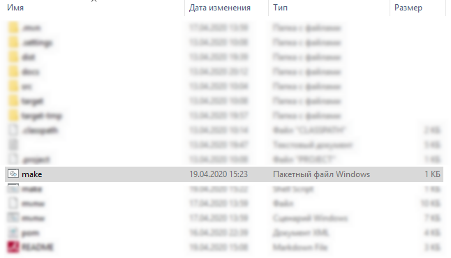
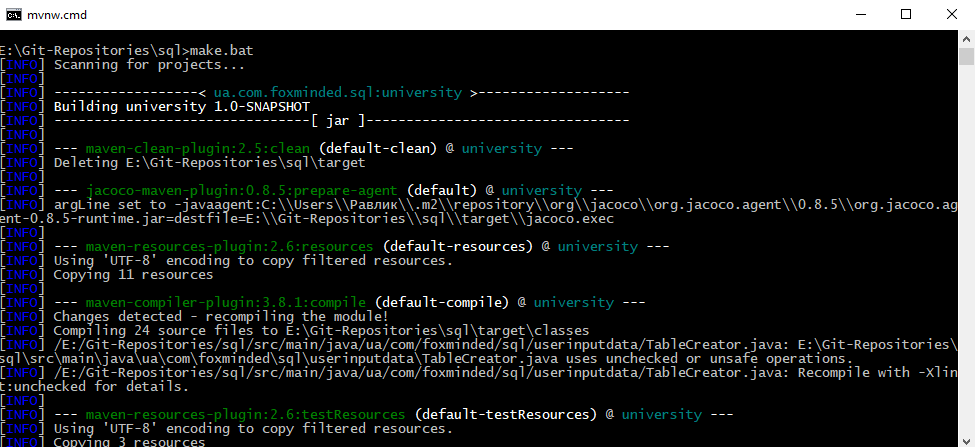
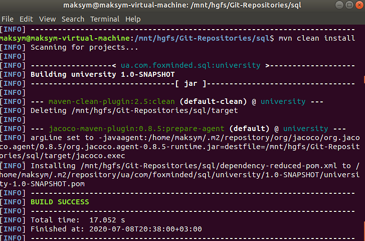
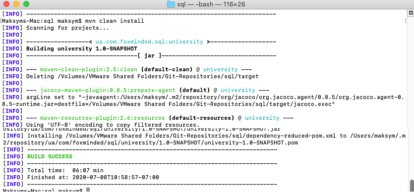
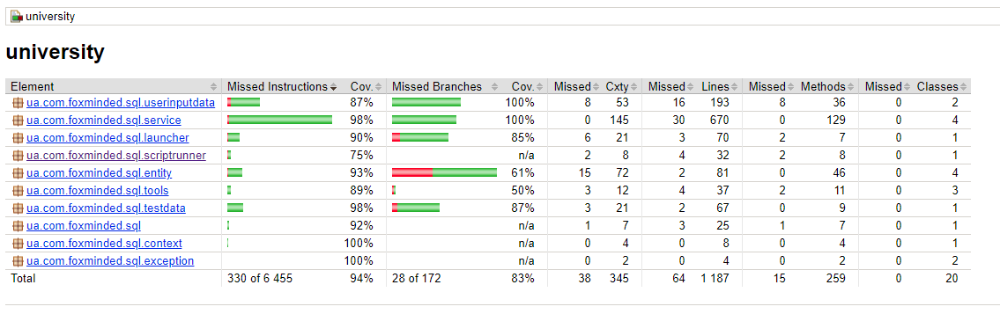

# SQL (Tasks 7) 
## Table of content  
* [Task](#Task)
* [How to build](#How-to-build)
* [File Structure](#File-structure)
* [Dependencies](#Dependencies)
* [Technologies](#Technologies)
* [Information and links](#Information-and-links)
* [Tests coverage report](#Tests-coverage-report)

## Task  
Create an application sql-jdbc-school that inserts/updates/deletes data in the database using JDBC.
Use PostgreSQL DB.

Tables (given types are Java types, use SQL analogs that fit the most:
```
groups(
    group_id int,
    group_name string
      )
      
students(
	student_id int,
	group_id int,
	first_name string,
	last_name string
)
courses(
	course_id int,
	course_name string,
	course_description string
)
```
1. Create SQL files with data:

	a. create user and database. Assign all privileges on the database to the user. (DB and user should be created before application runs)

	b. create a file with tables creation

2. Create a java application

	a. On startup, it should run SQL script with tables creation from previously created files. If tables already exist - drop them.

	b. Generate test data:

    * 10 groups with randomly generated names. The name should contain 2 characters, hyphen, 2 numbers

    * Create 10 courses (math, biology, etc)

    * 200 students. Take 20 first names and 20 last names and randomly combine them to generate students.

    * Randomly assign students to groups. Each group could contain from 10 to 30 students. It is possible that some groups will be without students or students without groups

    * Create relation MANY-TO-MANY between tables STUDENTS and COURSES. Randomly assign from 1 to 3 courses for each student

3. Write SQL Queries, it should be available from the application menu:

	a. Find all groups with less or equals student count

	b. Find all students related to course with given name

	c. Add new student

	d. Delete student by STUDENT_ID

	e. Add a student to the course (from a list)

	f. Remove the student from one of his or her courses

## How to build:  
Make sure Java Development Kit (JDK) and Maven tool installed on your machine.

There are two options how to build project:

* Windows:
   
   - double-click on `make.bat`:
  

  
   - or use Command Prompt:  navigate to project's root folder and type `make.bat` command:


      
   - or use `mvnw.cmd package` command in Terminal (Maven Wrapper)
   
   - or use `mvn package` command in Terminal (Maven)
      
* Linux/MacOS:

   - execute `make.sh` script file by using `./make.sh` command:
      

      

   
   - or use `./mvnw package` command in Terminal (Maven Wrapper)
   
   - or use `mvn package` command in Terminal with Maven

`make.bat` and `make.sh` will create a `dist` folder with application execution jar, batch + bash files and _README file for users. 

## File structure 
```bash
├── src
│   ├── main
│   │   ├── java
|   |   |   |-- ua/com/foxminded/sql
|   |   |   |   └── Main.java
|   |   |   |   
│   │   |   │── ua/com/foxminded/sql/context
│   │   |   │   └── Context.java
│   │   |   │
│   │   |   │── ua/com/foxminded/sql/dao
|   |   |   |   |-- CourseDAO.java
|   |   |   |   |-- GroupDAO.java
|   |   |   |   |-- StudentCourseDAO.java
│   │   |   │   └── StudentDAO.java
│   │   |   │
│   │   |   │── ua/com/foxminded/sql/entity
|   |   |   |   |-- Course.java
|   |   |   |   |-- Group.java
|   |   |   |   |-- StudentCourse.java
│   │   |   │   └── Student.java
│   │   |   │
│   │   |   │── ua/com/foxminded/sql/exception
|   |   |   |   |-- DAOException.java
│   │   |   │   └── NoSuchCourseException.java
│   │   |   │
│   │   |   │── ua/com/foxminded/sql/launcher
│   │   |   |   └── ScriptLauncher.java
│   │   |   |
│   │   |   │── ua/com/foxminded/sql/scriptrunner
│   │   |   |   └── SqlScriptRunner.java
│   │   |   |
│   │   |   │── ua/com/foxminded/sql/service
|   |   |   |   |-- CourseService.java
|   |   |   |   |-- GroupService.java
|   |   |   |   |-- StudentCourseService.java
│   │   |   │   └── StudentService.java
│   │   |   │ 
│   │   |   │── ua/com/foxminded/sql/testdata
│   │   |   │   └── TestDataGenerator.java
│   │   |   |
│   │   |   │── ua/com/foxminded/sql/tools
|   |   |   |   |-- DBAccess.java
|   |   |   |   |-- LogConfigurator.java
│   │   |   │   └── ScriptReader.java
│   │   |   |
│   │   |   └── ua/com/foxminded/sql/userinputdata
|   |   |       |-- TableCreator.java
│   │   |       └── UserQuery.java
│   │   |
|   |   └── resources
|   |       |-- properties
|   |       |   └── db.properties
|   |       └── scripts
|   |           |--application-queries
|   |           |   |-- Add_a_student_to_the_course_(from_a_list).sql
|   |           |   |-- Add_new_student.sql
|   |           |   |-- Delete_student_by_student_id.sql
|   |           |   |-- Find_all_students_related_to_course_with_given_name.sql
|   |           |   |-- Find_groups_with_less_or_equals_X_students.sql
|   |           |   └── Remove_the_student_from_one_of_his_or_her_courses.sql
|   |           |  
|   |           |-- data.sql
|   |           |-- initial_creation.sql
|   |           |-- queries.sql
|   |           └── tables.sql
|   |           
│   └── test
│       ├── java
|       |   |-- ua/com/foxminded/sql
|       |   |   └── MainTest.java
|       |   |   
│       |   │── ua/com/foxminded/sql/context
│       |   │   └── ContextTest.java
│       |   │
│       |   │── ua/com/foxminded/sql/entity
|       |   |   |-- CourseTest.java
|       |   |   |-- GroupTest.java
|       |   |   |-- StudentCourseTest.java
│       |   │   └── StudentTest.java
│       |   │
│       |   │── ua/com/foxminded/sql/launcher
│       |   |   └── ScriptLauncherTest.java
│       |   |
│       |   │── ua/com/foxminded/sql/scriptrunner
│       |   |   └── SqlScriptRunnerTest.java
│       |   |
│       |   │── ua/com/foxminded/sql/service
|       |   |   |-- CourseServiceTest.java
|       |   |   |-- GroupServiceTest.java
|       |   |   |-- StudentCourseServiceTest.java
│       |   │   └── StudentServiceTest.java
│       |   │ 
│       |   │── ua/com/foxminded/sql/testdata
│       |   │   └── TestDataGeneratorTest.java
│       |   |
│       |   └── ua/com/foxminded/sql/userinputdata
|       |       |-- TableCreatorTest.java
│       |       └── UserQueryTest.java
│       |
|       └── resources
|           |-- properties
|           |   └── db.properties
|           └── scripts
|               |-- data.sql
|               └── tables.sql
|
├── docs
│   └── img
│       └── *.png
│-- target
├── .gitignore
├── make.bat
├── make.sh
|-- _README.md
└── README.md
```

## Dependencies: 
- JUnit Platform: junit-platform-console-standalone-1.6.0 ([download](https://mvnrepository.com/artifact/org.junit.platform/junit-platform-console-standalone/1.6.0))
- JUnit TestEngine API: junit-jupiter-api-5.6.0 ([download](https://mvnrepository.com/artifact/org.junit.jupiter/junit-jupiter-api/5.6.0))
- Mockito mocking framework for unit tests: mockito-all-1.10.19 ([download](https://mvnrepository.com/artifact/org.mockito/mockito-all/1.10.19))
- JaCoCo - Java Code Coverage Library 0.8.5 ([download](https://mvnrepository.com/artifact/org.jacoco/jacoco-maven-plugin/0.8.5))
- Maven Wrapper ([download](https://mvnrepository.com/artifact/io.takari/maven-wrapper))
- Maven Shade Plugin: maven-shade-plugin-3.2.3 ([download](https://apache.ip-connect.vn.ua/maven/plugins/maven-shade-plugin-3.2.3-source-release.zip))

## Technologies  Project is created with:
* Java EE 1.8
* Junit 5
* Maven
* PostgreSQL

## Information and links 
- Java SE Runtime Environment 8 (JRE) ([download](https://www.oracle.com/technetwork/java/javase/downloads/jre8-downloads-2133155.html))
- Apache Maven ([download](https://maven.apache.org/download.cgi))
- PostgreSQL ([download](http://www.enterprisedb.com/postgresql-tutorial-resources-training?cid=48))
- Eclipse ([download](https://www.eclipse.org/downloads/))

## Tests coverage report
  