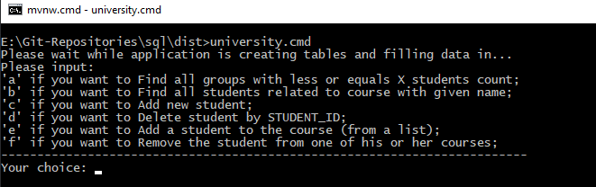
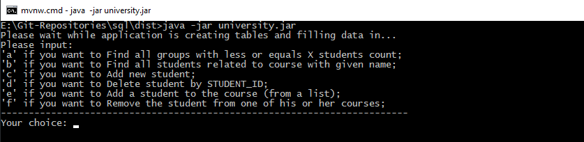

# University Application

## Description:

Application University that inserts/updates/deletes data in the database using JDBC.
Use PostgreSQL DB.

1. Application

	a. On startup, it should run SQL script with tables creation from previously created files. If tables already exist - it drops them.

	b. Generates test data:

    * 10 groups with randomly generated names. The name should contain 2 characters, hyphen, 2 numbers

    * Creates 10 courses (math, biology, etc)

    * Creates 200 students.

    * Randomly assigns students to groups. Each group could contain from 10 to 30 students. It is possible that some groups will be without students or students without groups

    * Creates relation between tables STUDENTS and COURSES. Randomly assigns from 1 to 3 courses for each student

2. You can write SQL Queries from the application menu:

	a. Find all groups with less or equals student count

	b. Find all students related to course with given name

	c. Add new student

	d. Delete student by STUDENT_ID

	e. Add a student to the course (from a list)

	f. Remove the student from one of his or her courses

## How to run:

1. By using University script:
     
     * In Windows:
        
     1) Open Command line
        
     2) Type `University.cmd` and press `Enter`

     >Notes:
     >* Make sure the `University.jar` is located at the same folder as `University.cmd`.

The result of successful application execution:

Then, simply follow instructions and choose the option you like.

2. By using Java archive (JAR) file (from dist folder):

* in Windows:

Then, simply follow instructions and choose the option you like.